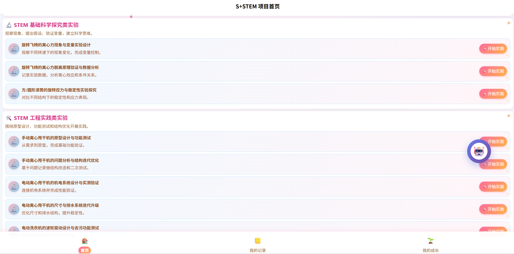
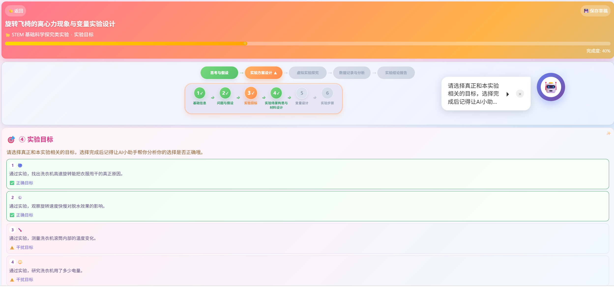
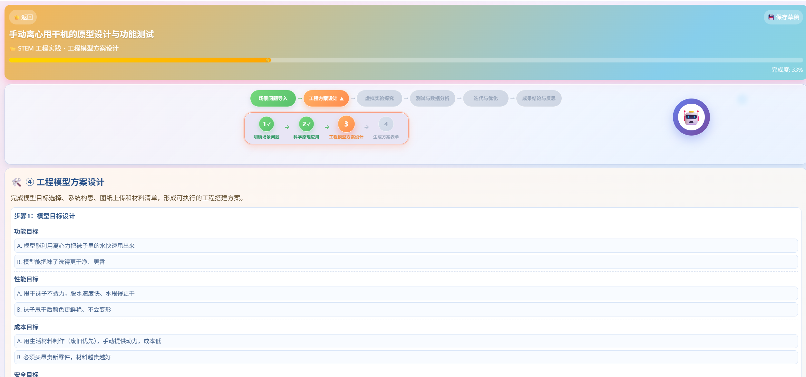
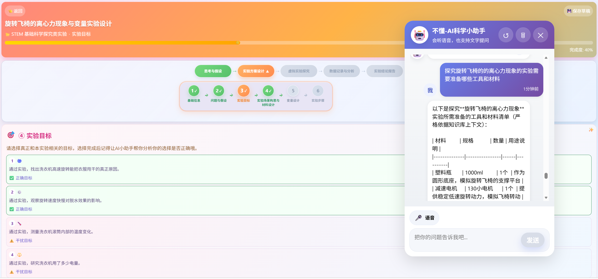

# STEM_Agent

STEM_Agent 是一个面向小学 STEM 实验课程的 AI 辅助学习平台。项目围绕“科学探究 + 工程实践 + AI 助教”构建学习闭环，支持实验流程引导、虚拟操作、数据记录、学习总结、RAG 知识库问答和流式 AI 对话。

## Demo 展示

### 首页与课程入口



### 科学实验流程



### 工程实验流程



### AIChat 流式回答


### RAG 问答




## 核心功能

- 实验课程页面：支持科学探究和工程实践两类 STEM 实验。
- 实验流程引导：覆盖实验介绍、材料准备、步骤操作、数据记录、总结报告等环节。
- AIChat 助手：前端浮窗式 AI 对话组件，支持普通回答和 SSE 流式回答。
- Hybrid RAG：Markdown loader、结构化切块、metadata 增强、向量检索、BM25 检索、RRF 融合、reranker。
- 大模型接入：预留 DashScope / Qwen 等 API 接入，也可接入本地大模型。
- RAG 评估：支持自定义 eval cases、bad case 记录和 Ragas 格式数据导出。


## 技术栈

Vue, JavaScript, FastAPI, RAG , Server-Sent Events

## 目录结构

```text
STEM_Agent/
  App.vue                         uni-app 根组件
  main.js                         前端入口
  pages/                          页面目录
  components/                     实验流程组件
  config/                         实验配置、素材路径、流程配置
  utils/                          前端 AI 服务、状态管理、工具函数
  static/                         静态资源目录
  backend/                        FastAPI + RAG 后端
    app/                          后端应用代码
      api/                        API 路由
      core/                       配置
      rag/                        RAG 模块
      schemas/                    请求和响应模型
      services/                   业务服务
    evals/                        RAG 评估用例和评估脚本
    knowledge_base/               知识库目录
    scripts/                      索引构建等脚本
```

## 快速开始

### 1. 克隆项目

```powershell
git clone https://github.com/mmpx0929/STEM_Agent.git
cd STEM_Agent
```

### 2. 准备后端环境

推荐使用 Python 3.10 或 3.11。

```powershell
cd backend
pip install -r requirements.txt
```

如果需要 FAISS：

```powershell
conda install -c conda-forge faiss-cpu
```

### 3. 配置大模型 Key

使用环境变量：

```powershell
$env:DASHSCOPE_API_KEY="你的 DashScope API Key"
```

`DASHSCOPE_API_KEY` 映射到后端使用的模型配置：

```text
STEM_LLM_API_KEY
STEM_EMBEDDING_API_KEY
STEM_RERANKER_API_KEY
```

### 4. 启动后端

推荐从项目根目录启动：

```powershell
.\start_ai_proxy.bat
```

也可以手动启动：

```powershell
cd backend
python -m uvicorn app.main:app --reload --host 127.0.0.1 --port 3000
```

启动后访问：

```text
http://127.0.0.1:3000
http://127.0.0.1:3000/docs
http://127.0.0.1:3000/api/v1/health
```

### 5. 启动前端

本项目是 uni-app 项目，推荐使用 HBuilderX


## RAG 流程

离线阶段：

```text
Markdown 实验文档
  -> 加载
  -> 清洗
  -> Markdown 结构感知切块
  -> metadata 增强
  -> embedding
  -> 向量索引
  -> BM25 稀疏索引
  -> 持久化
```

在线阶段：

```text
用户问题
  -> 查询理解 / 查询路由
  -> metadata filter
  -> 向量检索
  -> BM25 检索
  -> RRF 融合
  -> reranker
  -> prompt template
  -> LLM 生成回答
  -> 返回答案和 sources
```

## RAG 评估

项目支持三类评估：

```text
1. 自定义 eval cases：用于固定问题、期望命中内容、期望回答要点。
2. bad case 记录：用于沉淀检索失败、回答幻觉、上下文不相关等问题。
3. Ragas 格式导出：用于评估 faithfulness、context precision、response relevancy。
```

## License

本项目归作者本人所有，仅允许用于个人学习、课程作业、技术交流和非商业研究参考。未经作者书面许可，不得将本项目或其任何部分用于商业用途，包括但不限于商业产品、商业培训、付费课程、外包交付、竞品开发、二次售卖或以盈利为目的的部署服务。

