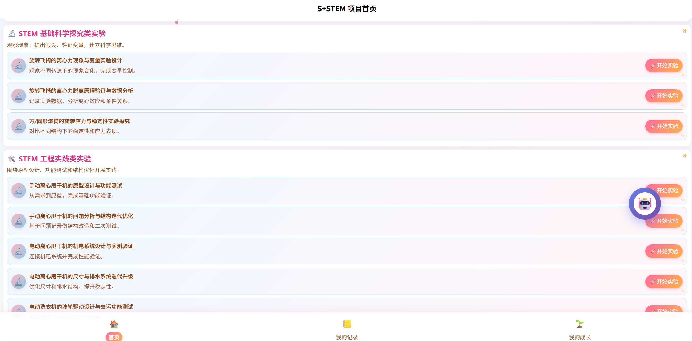
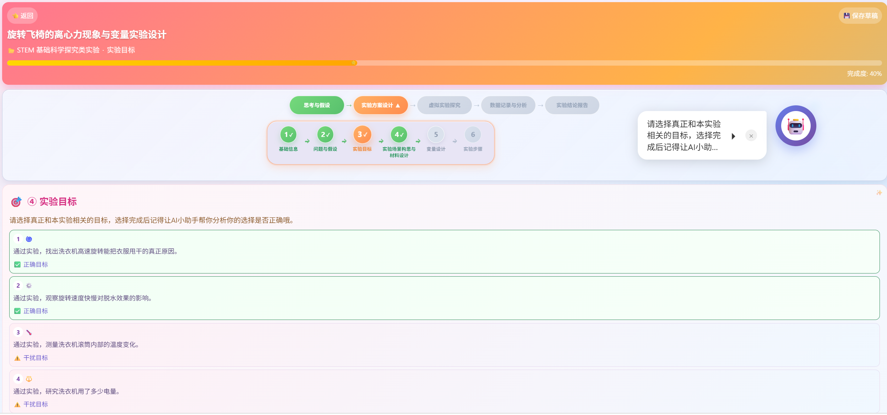
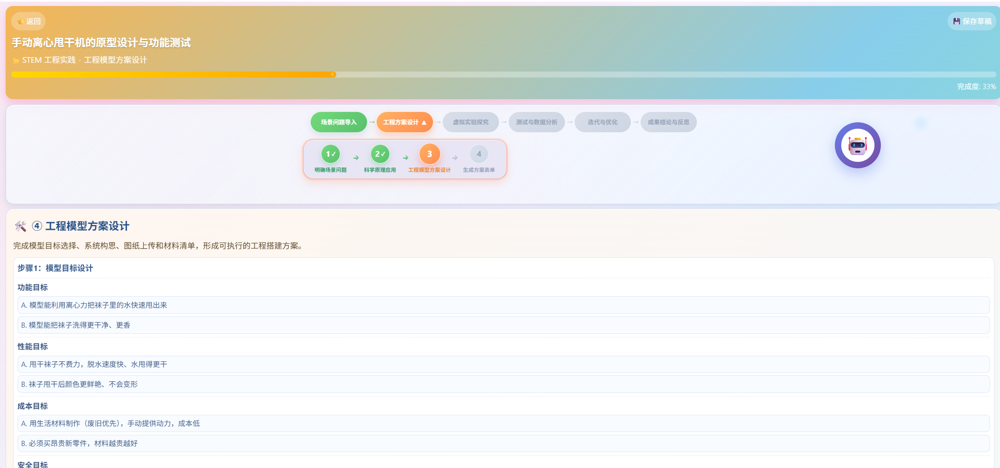
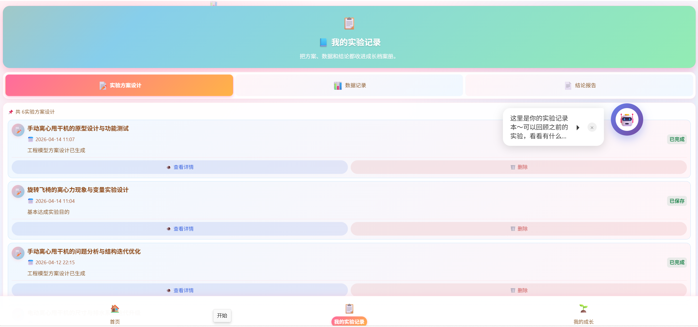
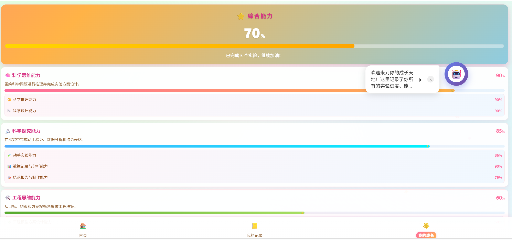
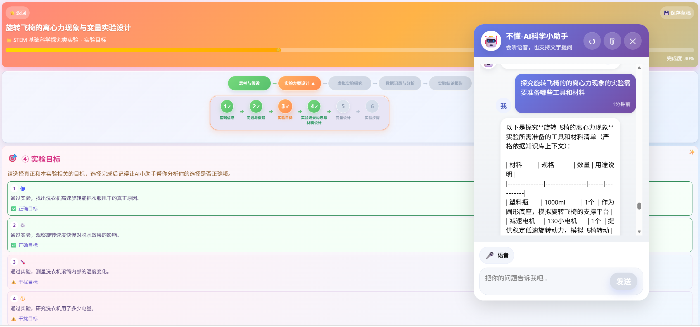

# STEM_Agent

STEM_Agent 是一个面向小学 STEM 实验课程的 AI 辅助学习平台。项目围绕“科学探究 + 工程实践 + AI 助教”构建学习闭环，支持实验流程引导、虚拟操作、数据记录、成长记录、RAG 知识库问答和流式 AI 对话。


## Demo 展示

### 首页与课程入口

首页提供 STEM 学习入口、实验课程导航和 AI 助手入口，便于学生从课程场景进入具体实验任务。



### 科学实验流程

科学实验页面围绕探究式学习组织内容，包括实验背景、材料准备、步骤引导、虚拟操作和总结环节。



### 工程实验流程

工程实验页面强调任务驱动和制作流程，支持学生按照工程实践路径完成设计、制作、测试和优化。



### 数据记录

数据记录页面用于沉淀实验过程中的观察结果、实验数据和学习记录，为后续总结与报告生成提供依据。



### 成长记录

成长记录页面用于展示学生学习过程、实验完成情况和阶段性成果，帮助形成持续学习反馈。



### RAG 问答效果

AIChat 结合当前实验上下文和后端知识库进行回答。后端通过 Hybrid RAG 检索相关实验流程、材料、安全注意事项和原理说明，再交给大模型生成更贴合实验场景的回答。



## 核心功能

- 实验课程页面：支持科学探究和工程实践两类 STEM 实验。
- 实验流程引导：覆盖实验介绍、材料准备、步骤操作、数据记录、总结报告等环节。
- AIChat 助手：前端浮窗式 AI 对话组件，支持普通回答和 SSE 流式回答。
- Hybrid RAG：支持查询改写、实验路由、结构化切块、metadata 增强、向量检索、BM25 检索、RRF 融合和 reranker。
- RAG 评估：支持自定义 eval cases、bad case 记录和 Ragas 格式数据导出。

## 技术栈

- 前端：uni-app、Vue 3、Vite、JavaScript、Sass
- 后端：FastAPI、Uvicorn、Pydantic
- RAG：FAISS / 本地向量兜底、BM25、RRF 融合、reranker、Markdown 知识库

## 目录结构

```text
STEM_Agent/
  README.md                       项目说明文档
  start_backend.bat               后端启动脚本
  assets/readme/                  README 图片
  frontend/                       前端
    package.json                  前端依赖与 npm scripts
    package-lock.json             前端依赖锁定文件
    vite.config.cjs               uni-app Vite 配置
    index.html                    H5 入口模板
    src/                          前端源码
      App.vue                     
      main.js                     
      pages.json                  
      manifest.json               
      pages/                      页面目录
      components/                 实验流程组件
      config/                     实验配置、素材路径、流程配置
      utils/                      API 调用、AI 服务、状态管理、工具函数                   
      static/                     教学资源
  backend/                        FastAPI + RAG 后端
    app/                          后端
      api/                        
      core/                       
      rag/                        RAG 
      schemas/                    
      services/                   
    evals/                        RAG 评估用例
    scripts/                      索引构建等脚本
    requirements.txt              后端 Python 依赖
```

## 快速开始

### 1. 克隆项目

```powershell
git clone https://github.com/mmpx0929/STEM_Agent.git
cd STEM_Agent
```

### 2. 准备后端环境

推荐使用 Python 3.10 或 3.11。

```powershell
cd backend
pip install -r requirements.txt
```

FAISS：

```powershell
conda install -c conda-forge faiss-cpu
```

### 3. 配置大模型 Key

使用环境变量：

```powershell
$env:DASHSCOPE_API_KEY="你的 DashScope API Key"
```

`DASHSCOPE_API_KEY` 映射到后端使用的模型配置：

```text
STEM_LLM_API_KEY
STEM_EMBEDDING_API_KEY
STEM_RERANKER_API_KEY
```

### 4. 启动后端

推荐从项目根目录启动：

```powershell
.\start_backend.bat
```

也可以手动启动：

```powershell
cd backend
python -m uvicorn app.main:app --reload --host 127.0.0.1 --port 3000
```

启动后访问：

```text
http://127.0.0.1:3000
http://127.0.0.1:3000/docs
http://127.0.0.1:3000/api/v1/health
```

### 5. 启动前端

首次安装依赖：

```powershell
cd frontend
npm install
```

启动：

```powershell
cd frontend
npm run dev:h5
```

构建H5：

```powershell
cd frontend
npm run build:h5
```

## RAG 流程

离线阶段：

```text
Markdown 实验文档
  -> 加载
  -> 清洗
  -> Markdown 结构感知切块
  -> metadata 增强
  -> embedding
  -> 向量索引
  -> BM25 稀疏索引
  -> 持久化
```

在线阶段：

```text
用户问题
  -> 查询改写 / 查询路由
  -> 实验与步骤上下文识别
  -> metadata filter
  -> 向量检索
  -> BM25 检索
  -> RRF 融合
  -> reranker
  -> prompt template
  -> LLM 生成回答
  -> 返回答案和 sources
```

## RAG 评估

项目支持三类评估：

```text
1. 自定义 eval cases：用于固定问题、期望命中内容、期望回答要点。
2. bad case 记录：用于沉淀检索失败、回答幻觉、上下文不相关等问题。
3. Ragas 格式导出：用于后续评估 faithfulness、context precision、response relevancy。
```

运行示例：

```powershell
cd backend
python evals\run_rag_eval.py
```

## License

本项目归作者本人所有，仅允许用于个人学习、课程作业、技术交流和非商业研究参考。未经作者书面许可，不得将本项目或其任何部分用于商业用途，包括但不限于商业产品、商业培训、付费课程、外包交付、竞品开发、二次售卖或以盈利为目的的部署服务。
